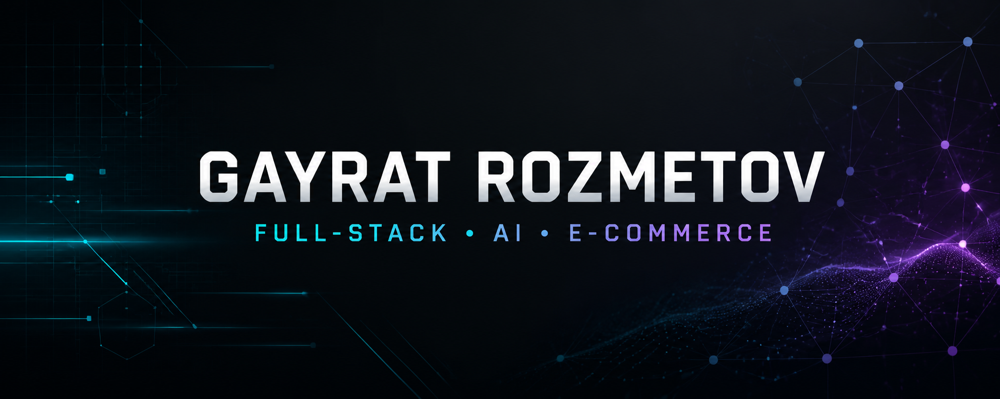

<p align="center">
  
</p>

<p align="center">
  <a href="mailto:gayrat0901@gmail.com">
    
  </a>
  
  
</p>

<p align="center">
  <a href="https://www.linkedin.com/in/gayrat-rozmetovv-ba5280150/">
    
  </a>
  <a href="mailto:gayrat0901@gmail.com">
    
  </a>
</p>

---

## About Me

I am a Full-Stack Software Engineer based in Istanbul, Türkiye. I build modern web applications, business tools, AI-powered solutions and e-commerce systems that solve real operational problems.

My background combines software engineering with e-commerce, visual design, product photography and video production. This allows me to approach digital products from both technical and commercial perspectives.

- Software Engineering graduate from Kırklareli University
- Experienced in web development and e-commerce operations
- Building AI-powered tools, automations and business dashboards
- Interested in scalable systems, clean interfaces and useful products
- Open to freelance projects, collaborations and international opportunities

---

## What I Can Build

<table>
  <tr>
    <td width="50%" valign="top">
      <h3>Web Development</h3>
      <ul>
        <li>Corporate websites and landing pages</li>
        <li>Full-stack web applications</li>
        <li>Admin panels and dashboards</li>
        <li>REST API integrations</li>
        <li>Responsive user interfaces</li>
        <li>Portfolio and e-commerce websites</li>
      </ul>
    </td>
    <td width="50%" valign="top">
      <h3>AI & Automation</h3>
      <ul>
        <li>AI-powered web tools</li>
        <li>Content generation workflows</li>
        <li>API-based AI integrations</li>
        <li>Business process automation</li>
        <li>Data processing utilities</li>
        <li>Productivity and internal tools</li>
      </ul>
    </td>
  </tr>
  <tr>
    <td width="50%" valign="top">
      <h3>E-Commerce Solutions</h3>
      <ul>
        <li>Product management systems</li>
        <li>Inventory and order dashboards</li>
        <li>Wholesale catalog solutions</li>
        <li>Marketplace integrations</li>
        <li>Operational workflow design</li>
        <li>Sales and product data tools</li>
      </ul>
    </td>
    <td width="50%" valign="top">
      <h3>Creative & Digital</h3>
      <ul>
        <li>UI and visual design</li>
        <li>Product photography</li>
        <li>Image editing and retouching</li>
        <li>Promotional video editing</li>
        <li>Social media creatives</li>
        <li>Technical consulting and support</li>
      </ul>
    </td>
  </tr>
</table>

---

## Technology Stack

### Frontend Development

<p>
  
</p>

### Backend & Database

<p>
  
</p>

### Cloud, DevOps & Development Tools

<p>
  
</p>

### Design & Creative Tools

<p>
  
</p>

<p>
  
  
  
  
</p>

---

## AI Tools & Technologies

<p>
  
  
  
  
  
</p>

I use AI to accelerate research, software development, content production, workflow automation and business operations. My focus is not only generating content, but turning AI capabilities into practical tools and repeatable systems.

---

## Commercial Experience

### E-Commerce & Fashion Technology

I work closely with real-world wholesale and retail e-commerce operations. This experience helps me understand both the software and business sides of digital commerce.

- Online product and catalog management
- Wholesale and retail sales workflows
- Product content and visual production
- Inventory and order organization
- Marketplace and e-commerce platform operations
- International customer communication
- Process improvement through software and automation

---

## Selected Projects

| Project | Description | Technologies | Status |
|---|---|---|---|
| [Smart Focus Dashboard](https://github.com/GayratRozmetov/smart-focus-dashboard) | Productivity dashboard with tasks, goals and focus sessions — [Live Demo](https://smart-focus-dashboard.cloudy-beech-0660.chatgpt.site) | Next.js, React, TypeScript | Live |
| AI Content Assistant | AI-powered content creation and management application | Next.js, TypeScript, AI API | Planned |
| E-Commerce Command Center | Product, inventory and order management dashboard | React, Node.js, PostgreSQL | Planned |
| Wholesale Catalog System | Digital product catalog and customer presentation platform | Next.js, Database, Cloud | Planned |

Completed projects will include source code, screenshots, documentation and live demo links.

---

## How I Work

```text
01. Understand the problem
02. Define the requirements
03. Design a practical solution
04. Build clean and maintainable code
05. Test the complete workflow
06. Deliver and improve
